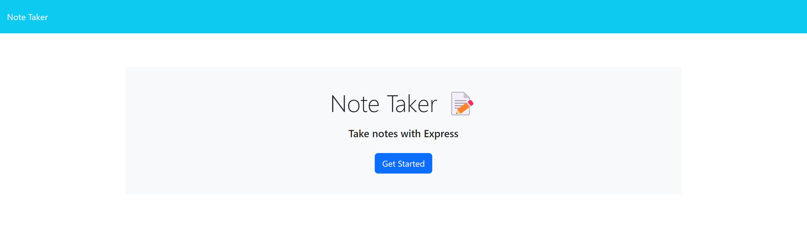
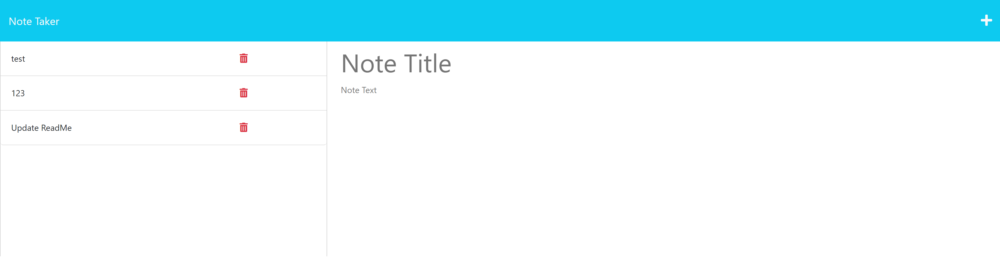

# Notebook

## Description
This is a notebook created with HTML, CSS, and Express that stores a title of a note and text content. All content is stored inside of a JSON file to be able to be displayed as needed.

## Installation
Run `npm -i` for necessary packages.

## Usage

.png)

## Features
* Create a note with a title and text
* Save the notes to be viewable later

## Deployed Application
https://fierce-mesa-98649.herokuapp.com/